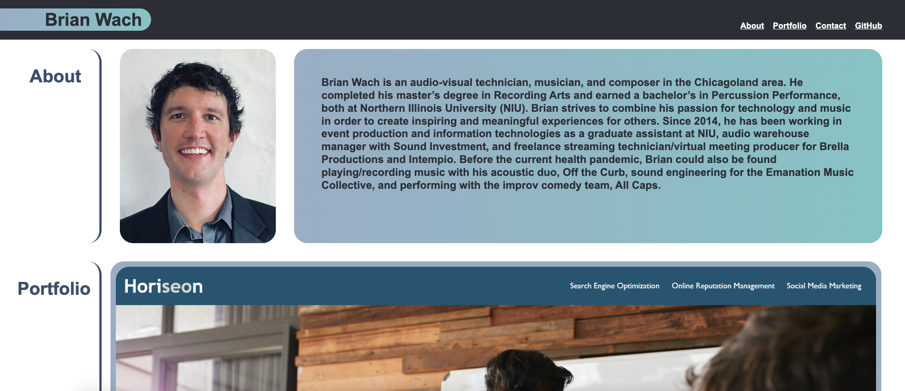
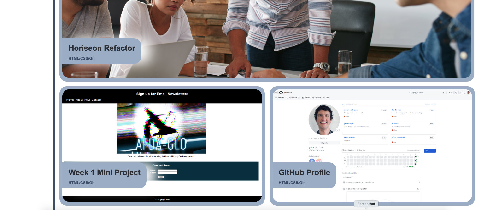
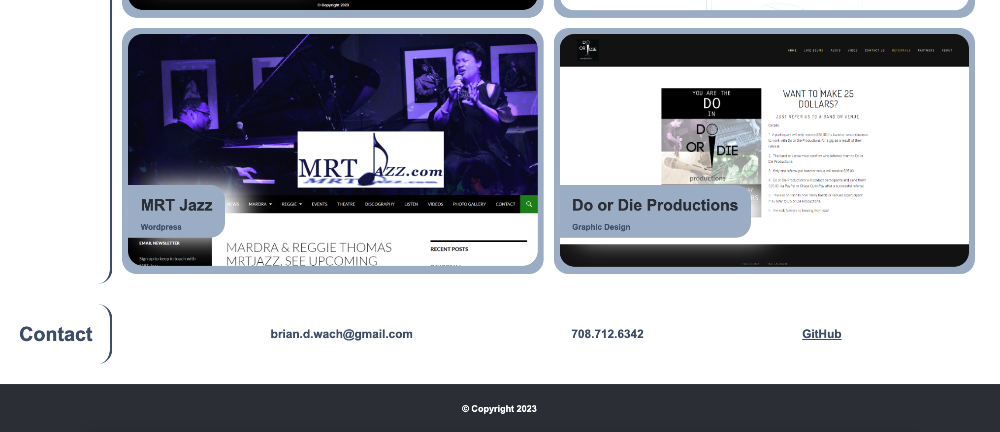
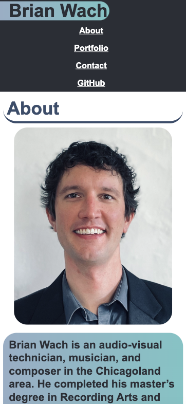
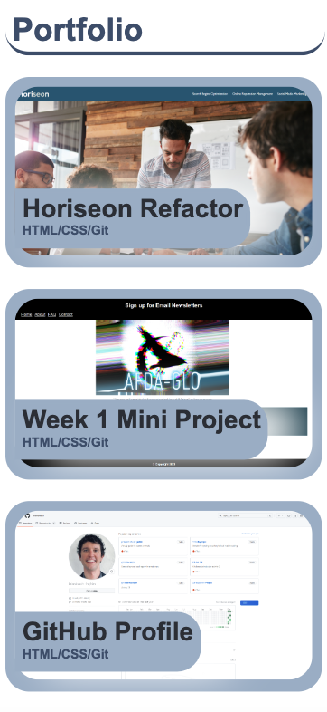
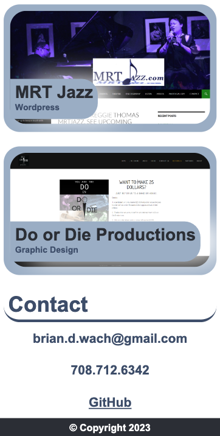

# Personal Web Development Portfolio

## The goal of this project was to create a personal web development portfolio that demonstrates my advanced CSS knowledge and ability to create a responsive web page.

I learned the following:
- How to build an HTML file from scratch and link it to a stylesheet. 
- How to use advanced CSS styling properties to create a responsive layout that is easily viewable on a traditional laptop screen, as well as, a mobile phone.
- How to use psuedo elements, classes, and IDs in order to create a visually appealing and interactive web page. 

## Usage

The final website can be viewed here:
https://briandwach.github.io/briandwachportfolio

- The "About", "Portfolio", and "Contact" links on the navigation bar will scroll you to the appropriate part of the webpage.  The "GitHub" link in the navigation bar and in the Contact section will open up my GitHub profile page in a new tab or window depending on a user's browser settings.  
- The first example work in the Portfolio section has been styled to be larger than the examples below it.  I used the flex-wrap property in CSS in order to accomplish this.  
- When the viewport size decreases, there are 3 media queries responding to the max-width of the screen to accomodate viewing the webpage on a mobile phone.  Note that the different sections respond at different times.  

The code repository can be accessed here:
https://github.com/briandwach/briandwachportfolio

  

## Credits
reset.css stylesheet originated from the class activities Northwestern University GitLab repository: NU-VIRT-FSF-PT-12-2023-U-LOLC

at the following private link:
https://git.bootcampcontent.com/Northwestern-University/NU-VIRT-FSF-PT-12-2023-U-LOLC/-/tree/main/02-Advanced-CSS/01-Activities/11-Ins_CSS-Resets?ref_type=heads

